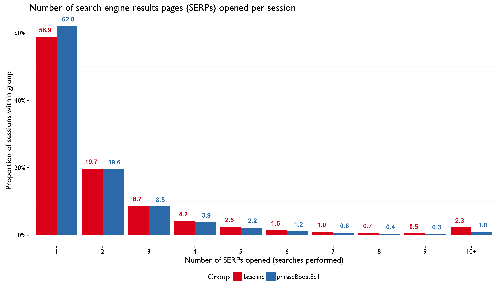

```{r setup, include = FALSE}
knitr::opts_chunk$set(echo = FALSE, message = FALSE, warning = FALSE)
```

\renewcommand{\abstractname}{Executive Summary}
\begin{abstract}
...
\end{abstract}

## Backgrounds

## Analysis of impact on user behavior metrics

### Number of searches per session



### Clickthrough rate


### Position of first clicked result


### Position of first and second clicked results


### Time to first clickthrough


### Number of results visited


### Search session duration


### Time spent on visited pages

## Discussion
