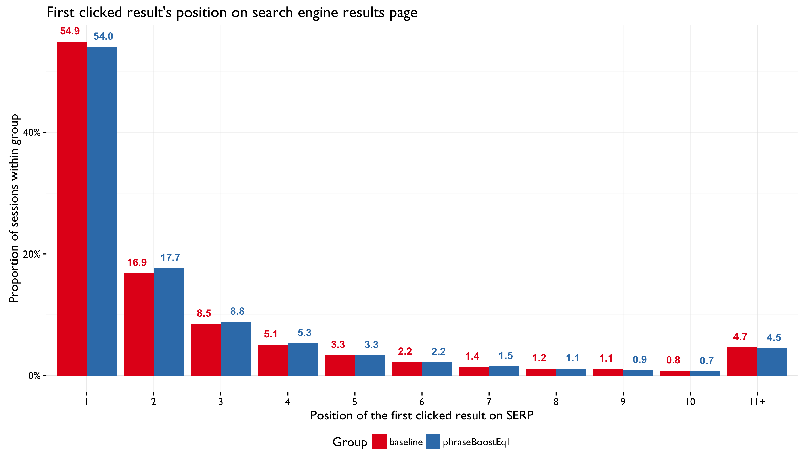
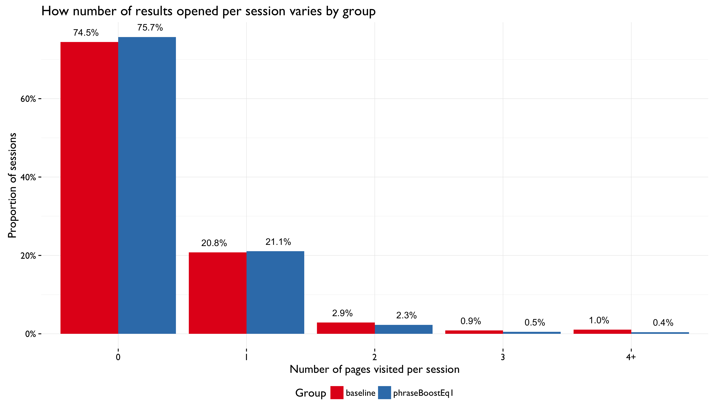
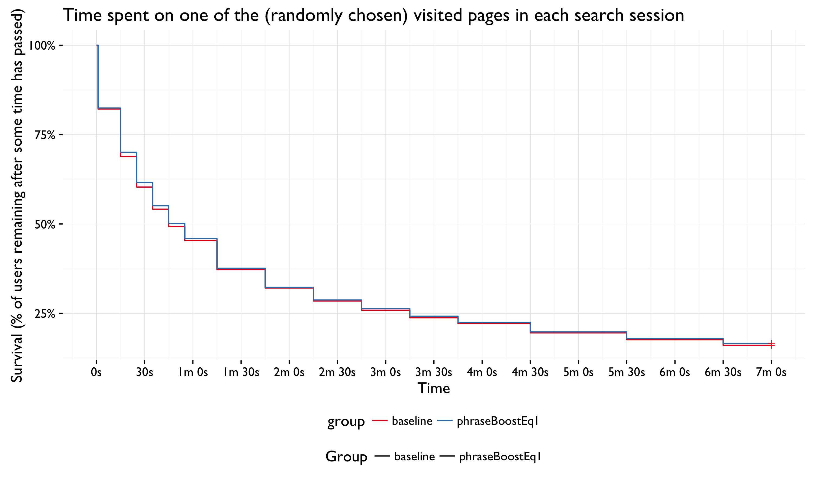

```{r setup, include = FALSE}
knitr::opts_chunk$set(echo = FALSE, message = FALSE, warning = FALSE)
```

\renewcommand{\abstractname}{Executive Summary}
\begin{abstract}
From 15 March 2016 to 22 March 2016 the Discovery/Search team ran an A/B test to assess how changing the phrase rescore boost from its current value of 10 to a proposed value of 1 would affect our users' behavior. Phrase rescore reorders the returned results, ranking results that have the same phrase higher. It appeared to be overboosted so we hypothesized that it may yield sub-optimal results.

It is important to note right up front that the differences in metrics/distributions between the test group (users with phrase rescore boost of 1) and the control (users with phrase rescore boost of 10) were close to 0 and were not statistically significant.

\begin{itemize}
  \item The test group has a slightly higher proportion of sessions with only 1 or 2 search results pages than the control group, which has a slightly higher proportion of multi-search sessions.
  \item While it looks like the control group had a much higher clickthrough rate than the test group due to the scale of the chart, the actual difference was really close to 0 (test group had 0.28\%-1.5\% higher abandonment rate), and a Bayesian estimation of the relative risk (0.953-1.086 times more likely) makes it unclear whether one group was more or less likely to clickthrough than the other group.
  \item Most of the users clicked on the first result they're presented with. We had some expectation that this might change, but it is unsurprising that the two groups behaved almost exactly the same. Most of the users clicked on a search result within the first 25 seconds, with 10s being the most common first clickthrough time. This did not vary by group.
  \item Number of results visited did not change by much between the two groups, although it looks like a slightly larger proportion of the test group visited fewer (1-2) results than the control group (larger \% of sessions with 3+ clickthroughs). It also looks like more test group users have shorter sessions than the control group, with a slightly greater number of test users having sessions lasting 10-30s and a slightly greater number of control users having sessions lasting more than 10 minutes. Users in the test group remained just a little bit longer on pages they visited than the control group, but barely so.
\end{itemize}
  
Putting the close-to-0-differences aside, if we take a very naive look at the differences and focus on their direction, we still cannot determine whether the change is a positive or negative (however small) impact for our users. Fewer searches may mean better results, or it may (cynically) mean users figuring out faster that they're not going to find what they're looking for. Certainly that's what a lower clickthrough rate and a slightly shorter average session length imply.

Perhaps in this particular case it may be worth making the config change decision based on how the different phrase rescore boost values affect the performance and computation time, since it doesn't appear to affect the user's behavior, at least in terms of the metrics analyzed in this report.
\end{abstract}

\newpage

## Backgrounds

[Rescoring](https://www.elastic.co/guide/en/elasticsearch/reference/current/search-request-rescore.html) can help to improve precision by reordering results using a secondary (usually more costly) algorithm, instead of applying the costly algorithm to all items in the index. When there are more than two words (generally a phrase) in the query _**phrase rescore** function_ tries to rank higher documents that have the same phrase (see [MediaWiki](https://www.mediawiki.org/wiki/Extension:CirrusSearch/Scoring#Rescoring)).

The phrase rescore appeared to be overboosted to us at its current value of 10, and we hypothesized that maybe it caused the first search engine results page (SERP) to be flooded by sub-optimal results. The phrase rescore is applied to the **all field** which means if a category perfectly matches all its article have good chance to be part of the first result page. In a preliminary analysis ([T128071](https://phabricator.wikimedia.org/T128071)) using [Relevance Forge](http://git.wikimedia.org/blob/wikimedia%2Fdiscovery%2FrelevanceForge.git/master/README.md) (*RelForge* is also on [GitHub](https://github.com/wikimedia/wikimedia-discovery-relevanceForge)), it appeared that changing the boost to a value of 1 resulted in 20% of the queries having different pages in the top 20.

So we decided to pursue this as an A/B test ([T129593](https://phabricator.wikimedia.org/T129593)) to see whether the change would have a positive impact on search results with regards to various user behavior metrics. Specifically, we decided to judge the impact of the configuration change by assessing: number of searches per session, clickthrough rate, position of first clicked result, time to first clickthrough, number of results visited (pages opened), session duration, and time spent on visited page(s).

We ran the test from 15 March 2016 to 22 March 2016 on 0.5% of the users searching various wiki projects. This test did not affect autocomplete (prefix/completion suggester) and did not have any effect on zero results rate, hence the use of event logging to collect user behavior metrics. After removing known spiders, the dataset we analyzed in this report contained 134,952 independent full-text search sessions.

## Statistical analysis of impact on user behavior metrics

### Number of searches per session


To compare the these two discrete distributions, we used [bootstrapping](https://en.wikipedia.org/wiki/Bootstrapping_(statistics)) with the [Kullback-Leibler divergence](https://en.wikipedia.org/wiki/Kullback%E2%80%93Leibler_divergence) metric, which allowed us to assess the probability of obtaining a K-L statistic equal to or greater than the K-L statistic observed. The observed K-L value was 0.022 (close to 0, signifying similarity) with a 95% Confidence Interval of (0.013, 0.021). The *p*-value was 0.993 so we cannot reject the hypothesis that the two distirbutions are the same.

### Clickthrough rate (CTR)


|                                  | 95% Bayesian C.I.           |
|:---------------------------------|:---------------------------:|
|Bayes Factor Test of independence | Some evidence against hypothesis of independence. |
|Test Group - Control Group        | (-1.503%, -0.284%)          |
|Relative Risk                     | (0.953, 1.086)              |

### Position of first clicked result



To compare the these two discrete distributions, we used [bootstrapping](https://en.wikipedia.org/wiki/Bootstrapping_(statistics)) with the [Kullback-Leibler divergence](https://en.wikipedia.org/wiki/Kullback%E2%80%93Leibler_divergence) metric, which allowed us to assess the probability of obtaining a K-L statistic equal to or greater than the K-L statistic observed. The observed K-L value was 0.015 (close to 0, signifying similarity) with a 95% Confidence Interval of (0.002, 0.014). The *p*-value was 0.995 so we cannot reject the hypothesis that the two distirbutions are the same.

<!-- ### Position of first and second clicked results
 -->

### Time to first clickthrough


We performed the Kolmogorov-Smirnov Test to check if the two continuous distributions of time to first clickthrough were different between the two groups and found that we **cannot reject** (*p*-value = 0.9656) that the times were drawn from the same distribution -- in other words, that the two distributions are the same.

### Number of results visited



To compare the groups' number of results visited distributions, we bootstrapped the Kullback-Leibler divergence metric. The observed K-L value was 0.008 (close to 0, signifying similarity) with a 95% Confidence Interval of (0.004, 0.009). The *p*-value was 0.893 so we cannot reject the hypothesis that the two distirbutions are the same.

### Search session duration


Due to the size of the dataset, we could not perform a straight Kolmogorov-Smirnov Test to compare the two distributions (larger sample sizes yield smaller *p*-values, yielding statistically significant difference where there is no practical difference). As before, we used *boostrapping* but instead applied it to the Kolmogorov-Smirnov test statistic. The observed K-S statistic was 0.012 -- with a 95% C.I. (0.005, 0.016) -- and the bootstrapped *p*-value was 0.698, which means we do not have sufficient evidence of the groups' session length distributions being significantly different.

\newpage

### Time spent on visited pages

**First visited page:**


| time| baseline| phraseBoostEq1|difference                                     |
|----:|--------:|--------------:|:----------------------------------------------|
|    1|   74.49%|         74.87%|barely higher % of test group remained on page |
|   15|   59.29%|         60.34%|barely higher % of test group remained on page |
|   25|   50.61%|         51.45%|barely higher % of test group remained on page |
|   35|   44.41%|         45.22%|barely higher % of test group remained on page |
|   45|   39.79%|         40.74%|barely higher % of test group remained on page |
|   55|   36.23%|         37.05%|barely higher % of test group remained on page |
|   75|   29.38%|         30.06%|barely higher % of test group remained on page |
|  105|   25.21%|         25.75%|barely higher % of test group remained on page |
|  135|   22.42%|         22.98%|barely higher % of test group remained on page |
|  165|   20.40%|         20.93%|barely higher % of test group remained on page |
|  195|   18.71%|         19.29%|barely higher % of test group remained on page |
|  225|   17.48%|         17.90%|barely higher % of test group remained on page |
|  270|   15.51%|         15.76%|barely higher % of test group remained on page |
|  330|   13.98%|         14.33%|barely higher % of test group remained on page |
|  390|   12.73%|         13.18%|barely higher % of test group remained on page |

\newpage

**Randomly selected visited page** (useful when there were several pages opened):



| time| baseline| phraseBoostEq1|difference                                     |
|----:|--------:|--------------:|:----------------------------------------------|
|    1|   75.33%|         75.70%|barely higher % of test group remained on page |
|   15|   60.32%|         61.50%|barely higher % of test group remained on page |
|   25|   51.78%|         52.66%|barely higher % of test group remained on page |
|   35|   45.68%|         46.65%|barely higher % of test group remained on page |
|   45|   41.14%|         42.15%|barely higher % of test group remained on page |
|   55|   37.77%|         38.44%|barely higher % of test group remained on page |
|   75|   30.82%|         31.44%|barely higher % of test group remained on page |
|  105|   26.63%|         27.08%|barely higher % of test group remained on page |
|  135|   23.71%|         24.26%|barely higher % of test group remained on page |
|  165|   21.70%|         22.17%|barely higher % of test group remained on page |
|  195|   19.97%|         20.49%|barely higher % of test group remained on page |
|  225|   18.69%|         19.08%|barely higher % of test group remained on page |
|  270|   16.60%|         16.84%|barely higher % of test group remained on page |
|  330|   15.00%|         15.36%|barely higher % of test group remained on page |
|  390|   13.70%|         14.18%|barely higher % of test group remained on page |

\newpage

**Last visited page:**


| time| baseline| phraseBoostEq1|difference                                     |
|----:|--------:|--------------:|:----------------------------------------------|
|    1|   76.49%|         76.54%|barely higher % of test group remained on page |
|   15|   62.02%|         62.89%|barely higher % of test group remained on page |
|   25|   53.59%|         54.24%|barely higher % of test group remained on page |
|   35|   47.66%|         48.21%|barely higher % of test group remained on page |
|   45|   43.05%|         43.75%|barely higher % of test group remained on page |
|   55|   39.65%|         40.13%|barely higher % of test group remained on page |
|   75|   32.82%|         32.93%|barely higher % of test group remained on page |
|  105|   28.54%|         28.62%|barely higher % of test group remained on page |
|  135|   25.53%|         25.70%|barely higher % of test group remained on page |
|  165|   23.46%|         23.57%|barely higher % of test group remained on page |
|  195|   21.66%|         21.83%|barely higher % of test group remained on page |
|  225|   20.37%|         20.47%|barely higher % of test group remained on page |
|  270|   18.10%|         18.14%|barely higher % of test group remained on page |
|  330|   16.43%|         16.53%|barely higher % of test group remained on page |
|  390|   15.06%|         15.30%|barely higher % of test group remained on page |

\newpage

## Discussion

Across the board, the users who received the new boost configuration behaved the same as the control group. Whether you look at number of searches per session, the clickthrough rate, position of first clicked result, time to first clickthrough, number of results visited (clickthroughs per session), search session duration, and time spent on visited pages, there are tiny, insignificant differences -- both from statistical and practical perspectives.

Putting the close-to-0-differences aside, if we take a very naive look at the differences and focus on their direction, we still cannot determine whether the change is a positive **or** negative (however small) impact for our users. It is unclear how to interpret the differences. For example, the test group had a slightly higher proportion of sessions that only had 1 or 2 SERPs than the control group, which had a slightly higher proportion of multi-SERP sessions. Fewer searches may mean better results, or it may (cynically) mean users figuring out faster that they're not going to find what they're looking for. Certainly that's what a lower clickthrough rate and a slightly shorter average session length imply.
